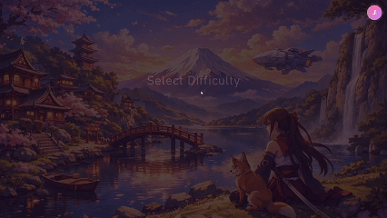

# Sliding Puzzle – Definitive Edition

A web-based sliding puzzle (8/35 pieces) built purely with HTML5, CSS3 and Vanilla JavaScript. Features multiple game modes, dynamic themes, ambient music, a local leaderboard, a beat-synced user circle inspired by **osu!**, and a fully refactored auto-solver backed by A\* with bitpacked state.

> **Scope note:** This project was made as a personal exercise to practise HTML, CSS and JavaScript. It was never intended to be a production application, so aspects like input sanitisation, authentication security or data encryption were deliberately left out of scope.

---

## Features

- Animated menus with dynamic section switching (`index.html` + `srcs/main.js`).
- Classic, Zen and Time Attack modes, each with their own rules, scoring and music.
- 3×3 or 6×6 difficulty selection (except Zen) and a countdown before the puzzle starts.
- Local account system (register/login) persisted in `localStorage` with a leaderboard sorted by score and time (`srcs/user.js`).
- Three complete themes (`default`, `anime`, `highschool`) that swap backgrounds, game music and victory music.
- Audio controls: volume slider, pause button, `P` keyboard shortcut and quick puzzle restart.
- **Beat-synced user circle** – pulses to the music in real time using the Web Audio API, inspired by the osu! logo effect (`srcs/beat_sync.js`).
- **Refactored auto-solver** – supports both 3×3 (A\* with bitpacked state) and 6×6 (reverse move history), split across a dedicated `srcs/solve/` module.
- Responsive interface with separate stylesheets (`styles/*.css`) for easy customisation.

---

## Project structure

```
.
├── index.html
├── README.md
├── .github/
│   └── workflows/
│       └── static.yml           # GitHub Pages deployment workflow
├── audios/
│   ├── default_music.mp3        # Default theme background music
│   ├── default_victory.mp3      # Default theme victory music
│   ├── default_click.MP3        # Tile click sound effect
│   ├── anime_music.mp3          # Anime theme background music
│   ├── anime_victory.mp3        # Anime theme victory music
│   ├── highschool_music.mp3     # Highschool theme background music
│   ├── highschool_victory.mp3   # Highschool theme victory music
│   └── zen1.mp3                 # Zen mode music (looped)
├── imagens/
│   ├── default_background.gif   # Default theme background
│   ├── anime_background.gif     # Anime theme background
│   ├── highschool_background.gif# Highschool theme background
│   └── demo.gif                 # Auto-solver demo GIF
├── styles/
│   ├── general.css              # Base/reset styles
│   ├── background.css           # Background GIF styling
│   ├── menu.css                 # Main menu layout
│   ├── form.css                 # Login/register forms
│   ├── buttons.css              # Button styles
│   ├── gameplay.css             # Game screen layout
│   ├── tiles.css                # Puzzle tile styles
│   ├── pause.css                # Pause menu overlay
│   ├── victory.css              # Victory screen
│   ├── audio_settings.css       # Volume slider and audio controls
│   └── user_circle.css          # Beat-synced user circle
├── srcs/
│   ├── main.js                  # Global state management and themes
│   ├── user.js                  # Register/login, leaderboard and storage
│   ├── game_setup.js            # Mode/difficulty selection and game start
│   ├── puzzle.js                # Puzzle generation, rendering and validation
│   ├── game_play.js             # Moves, scoring, victory and timers
│   ├── utilities.js             # Utility functions (formats, pause, exit)
│   ├── beat_sync.js             # Beat detection and user-circle animation
│   └── solve/
│       ├── state_codec.js       # Bitpacking encode/decode helpers
│       ├── heuristics.js        # Manhattan + Linear Conflict heuristic
│       ├── min_heap.js          # Binary min-heap for the A* open set
│       ├── solver_3x3.js        # A* solver for 3×3 puzzles
│       ├── solver_6x6.js        # Reverse-history solver for 6×6 puzzles
│       ├── auto_solve_runtime.js# Orchestrator + step animation
│       └── audio_score.js       # Zen music playback and score helpers
```

---

## How to run

1. Make sure you have a modern browser (Chrome, Edge, Firefox or similar).
2. Download/clone the repository and keep the folder structure intact.
3. Open `index.html` directly in the browser (double-click or _Open File_).
4. Allow audio if the browser requests permission.

> No external dependencies and no server required – everything runs client-side.

---

## How to play

1. **Main Menu**: choose Play, Options or Exit.
2. **Play**: decide whether to play as a guest, sign in or create a new account.
3. **Mode/Difficulty**:
   - Classic or Time Attack: choose between 3×3 (easy) and 6×6 (hard).
   - Zen: starts immediately in an infinite 3×3 loop with no scoring.
4. **Countdown**: wait 3 seconds before the puzzle is shown.
5. **Moves**: click a tile adjacent to the empty space to move it. In Classic each move costs 10 points; in Zen there is no score; in Time Attack you have 2 m 50 s to complete as many puzzles as possible.
6. **Pause/Resume**: use the Pause button or the `P` key. The pause menu lets you resume or return to the main menu.
7. **Auto-solver**: press the "Auto-solve" button to watch an animated solution.
8. **Victory**: view your stats (time, score or number of puzzles) and choose to restart or go back to the menu.

---

## Game modes

| Mode            | Objective                                                        | Scoring             |
| --------------- | ---------------------------------------------------------------- | ------------------- |
| **Classic**     | Finish with the best possible score                              | −10 points per move |
| **Zen**         | Relax – a new puzzle is generated automatically after each solve | None                |
| **Time Attack** | Complete as many puzzles as possible in 170 seconds              | Puzzle count        |

---

## Beat Circle (osu! inspired)

The user avatar circle visible during gameplay pulses in sync with the background music, replicating the pulsation effect of the **osu!** logo.

### How it works (`srcs/beat_sync.js`)

1. On the first user gesture, a `Web Audio API` `AudioContext` is created and the `<audio>` element is connected through an `AnalyserNode` (FFT size 2048).
2. Every frame (via `requestAnimationFrame`) the module reads:
   - **Bass energy** – the average amplitude of frequency bins 0–6 (~0–150 Hz), normalised to 0–1.
   - **Spectral flux** – the sum of all positive bin-level differences between the current and previous frame.
3. A rolling history of the last ~43 flux samples (~0.7 s at 60 fps) is maintained. A **beat** is detected when the current flux exceeds 1.5× the rolling average and the minimum cooldown (200 ms) has elapsed.
4. On a beat, the circle is slightly compressed (`scale < 1`) for ~60 ms and then eased back to normal. Between beats a gentle _breathing_ effect driven by bass energy keeps the circle subtly alive.
5. A CSS ripple element expands and fades out on every beat, reinforcing the hit-circle feel.

---

## Auto-solver & Bitmasking



The solver was fully rewritten and split into a dedicated `srcs/solve/` module. It now supports both puzzle sizes.

### Bitpacked state (`srcs/solve/state_codec.js`)

To make the A\* open-set lookups as fast as possible, each puzzle state is encoded into a single **JavaScript `BigInt`** instead of an array or string.

- `bitsPerTile = ⌈log₂(totalTiles)⌉` – the minimum number of bits needed to represent any tile value.
- Tile at position `i` is stored at bit offset `i × bitsPerTile`.
- A pre-computed `tileMask = (1n << bitsPerTile) - 1n` isolates a single tile.

Example for a 3×3 puzzle (9 tiles, values 0–8 → 4 bits each):

```
state = [1, 2, 3, 4, 5, 6, 7, 8, null]
packed = 0001 0010 0011 0100 0101 0110 0111 1000 0000
         tile0  tile1  tile2  ...                tile8(=0)
```

**Key operations:**

```js
// Read tile at position i
getPackedTile(packed, i, ctx)  →  Number((packed >> shifts[i]) & tileMask)

// Swap two tiles (e.g. move a piece into the empty slot)
swapPackedTiles(packed, a, b, ctx)
  // clears both slots with ~(tileMask << shift), then writes each tile into the other slot
```

Using `BigInt` bitwise ops means state comparisons and copies are O(1) and dictionary (Map) lookups use value equality automatically.

### 3×3 solver – A\* (`srcs/solve/solver_3x3.js`)

- **Open set**: custom binary min-heap (`srcs/solve/min_heap.js`) keyed on `f = g + h`.
- **Heuristic** (`srcs/solve/heuristics.js`): **Manhattan Distance + Linear Conflict**. Linear conflict adds +2 for every pair of tiles that are in their goal row/column but in the wrong order, making the heuristic admissible and stronger than plain Manhattan distance alone.
- States are stored as `BigInt` in a `Map<BigInt, g>` to avoid revisiting worse paths.

### 6×6 solver – Reverse history (`srcs/solve/solver_6x6.js`)

A\* is not practical for 6×6 (35-tile) puzzles in a browser. Instead, the solver replays the player's own move history in reverse order, which guarantees an optimal undo-path without any search overhead.

---

## Accounts and leaderboard

- All data lives in `localStorage` and stays in the user's browser only.
- Registration stores `username`, `password` (plain text – this is an academic/demo project), `highScore` and `time`.
- The leaderboard ignores theme and guests, sorted by highest score; ties broken by lowest time. In Time Attack mode the puzzle count is recorded instead.

---

## Themes, audio and accessibility

- Available themes: `default`, `anime`, `highschool`. They swap the background GIF, the main music and the victory music.
- The volume slider controls both the background music and the Zen playlist; the value is saved between sessions.
- The "Clear Data" button wipes all `localStorage` content (themes, accounts and leaderboard).
- Buttons have clear labels and the game accepts keyboard interaction (`P` to pause) in addition to mouse clicks.

---

## License

The source code of this project is licensed under the MIT License.

Audio tracks, images, and other media assets may be subject to different licenses or copyrights and are not included under the MIT License unless explicitly specified.

---
